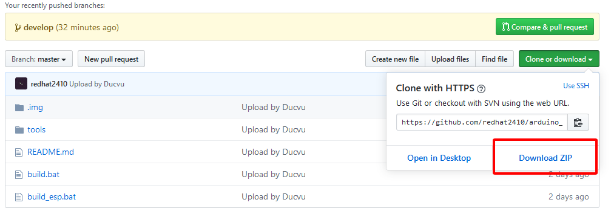
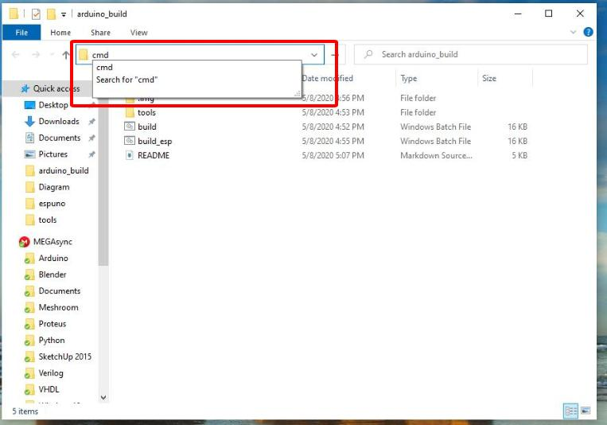
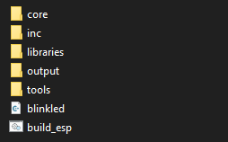
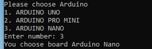
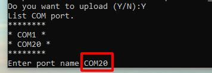
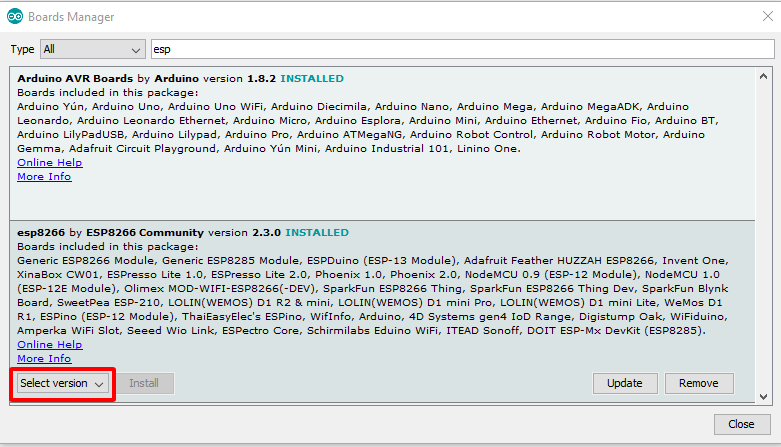

# Trình biên dịch AVR và ESP
Trình biên dịch được sử dụng cho các dòng vi điều khiển AVR và tương thích với các sản phẩm Arduino: Arduino Uno, Nano, Pro Mini ... . Trình biên dịch còn tương thích với các dòng ESP8266 như: ESP8266-v1, ESP8266-v7, ESP8266-v12. Tuy nhiên phiên bản này chỉ dành cho Windows.
## Cài đặt
Để sử dụng trình biên dịch đầu tiên:
- Thực hiên clone tools hỗ trợ từ github hoặc tải file zip từ github về máy (link github: https://github.com/redhat2410/arduino_build.git).

- Tạo thư mục chứa dự án mới.
- Sao chép thư mục **tools, build.bat và build_esp.bat** vào thư mục chứa dự án.
- Chạy tập tin **build.bat** cho các dự án thực hiện trên dòng **arduino AVR (arduino Uno, Nano, pro mini)**.
Để chạy tập tin **.bat** phải chạy bằng cửa sổ CMD (Command Prompt) của Windows

```bash
> cd new_project
> build.bat
```
- Chạy tập tin **build_esp.bat** cho các dự án thực hiện trên dòng **ESP8266-v01, ESP8266-v07, ESP8266-v12**.
Để chạy tập tin **.bat** phải chạy bằng termial CMD của Windows
```bash
> cd new_project
> build_esp.bat
```
## Bố cục
Sao khi chạy các file .bat thì bố cục trong thư mục dự án sẽ có dạng như sau:


- **Thư mục core/ :** có chức năng chứa các tập tin compile (.o, .d) của thư viện lõi của Arduino
- **Thư mục inc/  :** có chức năng chứa các tập tin thư viện do người lập trình định nghĩa ( .h, .c/.cpp ), ngoài ra còn chứa các tập tin thư viện tĩnh (.a)
- **Thư mục inc/lib/      :** có chức năng chứa các tập tin mã nguồn thư viện ngoài (.h, .c/.cpp) **khi sử dụng thư viện ngoài thì người dùng phải copy các mã nguồn của thư viện vào thư mục này ( nên tạo các thư mục để phân loại )**.
- **Thư mục libraries/    :** có chức năng chứa các tập tin compile (.o, .d) của thư viện giao tiếp (SPI, Wire, EEPROM, SoftwareSerial) của Arduino.
- **Thư mục output/       :** có chức năng chứa các tập tin compile (.o, .d) của chương trình chính và các tập tin chạy và nạp chương cho vdk (.elf, .hex, .bin...).
- **Thư mục tools/        :** có chức năng chứa các công cụ hỗ trợ cho việc biên dịch, yêu cầu không được xóa bất cứ tập tin nào trong thư mục này.
- **Tập tin new_project.cpp   :** tập tin sẽ được tạo ra trong lần chạy đầu tiên của .bat, tập tin được tạo ra với tên của thư mục chứa nó và với định dạng cpp.
## Sử dụng
**Sử dụng trình biên dịch cho vi điều khiển AVR thuộc Arduino.**
```bash
> cd new_project
> build.bat
```

**Sử dụng trình biên dịch cho dòng ESP8266.**
```bash
> cd new_project
> build_esp.bat
```

**Khi sử dụng trình biên dịch cho vi điều khiển AVR thì bạn cần phải lưu ý các điểm sau:**
- Bắt buộc phải cài đặt Arduino IDE ( Link download: https://www.arduino.cc/en/Main/Software ).
- Khi chạy tập tin build.bat có thể được hỏi phải cung cấp cho trình biên dịch đường dẫn cài đặt của Arduino IDE ( chỉ cần cung cấp 1 lần cho mỗi dự án ).
- Trình biên dịch sẽ hỏi bạn biên dịch cho dòng Arduino nào.

- Trong quá trình biên dịch, trình biên dịch sẽ hỏi bạn "Do you want to upload (Y/N)", bạn trả lời "Y" khi muốn nạp chương trình cho vi điều khiển, ngược lại "N" khi bạn chỉ muốn build chương trình.
- Sau khi đồng ý chọn nạp chương trình, trình biên dịch sẽ hỏi bạn nạp với cổng COM nào "Enter port name:"


**Khi sử dụng trình biên dịch cho ESP8266 thì bạn cần phải lưu ý các điểm sau:**
- Bắt buộc phải cài đặt Arduino IDE ( Link download: https://www.arduino.cc/en/Main/Software ).
- Cài đặt thư viện ESP8266 ( Link hướng dẫn http://arduino.vn/bai-viet/1172-lap-trinh-esp8266-bang-arduino-ide )
- Cài đặt thư viện ESP8266 với phiên bản **2.4.0** (cài đặt phiên bản thư viện bằng cách vào *Tools->Board->Board Manager*:

- Trong quá trình biên dịch, trình biên dịch sẽ hỏi bạn "Do you want to upload (Y/N)", bạn trả lời "Y" khi muốn nạp chương trình cho vi điều khiển, ngược lại "N" khi bạn chỉ muốn build chương trình.
- Sau khi đồng ý chọn nạp chương trình, trình biên dịch sẽ hỏi bạn nạp với cổng COM nào "Enter port name:"


**Lưu ý:**
**Các mã nguồn được đặt trong thư mục "inc\" (thư mục đặt thư viện cho người dùng tự định nghĩa) sẽ được biên dịch sang tập tin thư viện tĩnh (.a) vì vậy sau khi biên dịch các bạn có thể xóa tập tinh .c hoặc .cpp đễ bảo vệ mã nguồn.**

## Bản quyền
Bản quyền này thuộc về công ty TNHH giải pháp công nghệ Viethas (Link https://viethas.com/)